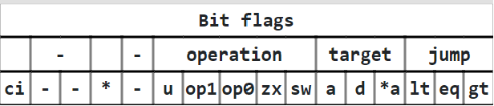
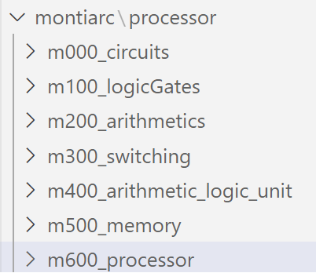
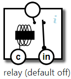
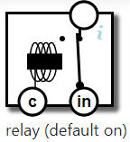

# CPU Simulation Using MontiArc Model
[toc]
## Description of this project

This project aims to simulate a mordern CPU with MVP (minimum viable product). With the help of some open-source schematics 
(like [NandGame](https://nandgame.com/)) and the powerful ADL Montiarc, we have implemented such CPU which fullfills all the requirements successfully.

## Performance Params

1. Simulated physical params

| Architecture | Memory Size | Data Precision | Instruction Size |
| ----- | ----- | ------ | ------ |
| von Neumann | 10 Bytes |    int8    | 16 Bit |

2. Operations

| Operations |
| ----- |
| X and Y |
| X or Y |
| X xor Y |
| invert X |
| X + Y |
| X - Y |
| X + 1 |
| X - 1 |
| Y - X |
| 0 - Y |
| 0 - X |
| Never |
| X > 0 |
| X = 0 |
| X ≥ 0 |
| X < 0 |
| X ≠ 0 |
| X ≤ 0 |
| Always |

3. 16-Bit Instruction




## Layer Hierarchy
### File Structure
The CPU is designed and modelled with different layers below. Each layers consists of montiarc components. The layer above is the dependency of all the layers below. `m000_circuits` is the basic layer which has only atomic montiarc components(e.g. RelayDefaultOff, RelayDefaultOn).
.

### Atomic Components (Relays)
> A relay logic circuit is an electrical network consisting of lines, or rungs, in which each line or rung must have continuity to enable the output device. [WiKi](https://en.wikipedia.org/wiki/Relay_logic#:~:text=A%20relay%20logic%20circuit%20is,each%20rung%20controlling%20an%20output.)

Here in our case, it is sufficient to only simulate the in-and output of relays regardless of its physical features.

|Relay Off|Relay On|
|---|---|
|||

Theoretically all components can be decomposed by bunch of relays with specific combinations.

### **Logic Gate**
#### NandGate
Our task is to connect inputs to output through wires and relays such that when both **a** and **b** inputs are 1, the output is 0.
**1** represents electrical current, **0** represents no current.
The **V** input carries constant current, i.e. always **1**.
The exact specification:


| Input | Input | Output |
| ----- | ----- | ------ |
| **a** | **b** |        |
| 0     |    0   |    1    |
| 0     |     1  |     1   |
| 1     |      0 |      1  |
| 1  | 1  | 0   |


#### Invert
Our next task is to build an inverter (**inv**) component.
This **inv**-component has a single input and a single output.
The output should be the opposite of the input, which can be visualized in the following tableau:


| **Input** | **Output** |      |
| ----- | ------ | ---- |
|    0   | 1       |  ✓    |
| 1    | 0      | ✓ |


#### And
We create here an **and** gate with an output which is 1 when both inputs are 1:


| Input | Input | Output |     |
| ----- | ----- | ------ | --- |
| **a**      |  **b**     |        |     |
|   0    |    0   |   0     |  ✓   |
|    0   |   1    |    0    |  ✓   |
|     1  |  0     |     0   |   ✓  |
|      1|  1 |     1   |   ✓  |


#### Or
We create an **or** gate with an output which is **1** when at least one input is 1:


| Input | Input | Output |     |
| ----- | ----- | ------ | --- |
| **a**      |  **b**     |        |     |
|   0    |    0   |   0     |  ✓   |
|    0   |   1    |    1    |  ✓   |
|     1  |  0     |     1   |   ✓  |
|      1|  1 |     1   |   ✓  |


#### Xor
We create an **xor** gate's with an output which is **1** when the two inputs are different:
| Input | Input | Output |     |
| ----- | ----- | ------ | --- |
| **a**      |  **b**     |        |     |
|   0    |    0   |   0     |  ✓   |
|    0   |   1    |    1    |  ✓   |
|     1  |  0     |     1   |   ✓  |
|      1|  1 |        |   ✓  |


### **Arithmetics**
Our next step is arithmetic operations. The processor are required to add and subtract numbers.

#### Half Adder
1. An add component is to add two one-bit numbers together. The result will be a two-bit number.
2. The **h** output is the high bit, the **l** is the low bit:


| Input    |   Input  | Output   |  Output  |
| -------- | -------- | -------- | -------- |
| **a**    | **b**     | **h**     | **l**     |
| 0    | 0     | 0     | 0     |
| 0    | 1     | 0     | 1     |
| 1    | 0     | 0     | 1     |
| 1    | 1     | 1     | 0     |


#### Full Adder
We have built an adder that can add two bits by Half Adder, but in order to add larger numbers we also need to take a 'carry' from a previous addition into consideration.

The component Full Adder adds three bits: **a**, **b**, and **c**. The output is a two-bit value. The **h** output is the high bit, the **l** is the low bit:

| Input    |   Input  | Input  | Output   |  Output  |
| -------- | -------- | -------- | -------- | -------- |
| **a**    | **b**     | **c**     | **h**     | **l**     |
| 0    | 0     | 0     | 0     | 0     |
| 0    | 0     | 1     | 0     | 1     |
| 0    | 1     | 0     | 0     | 1     |
| 0    | 1     | 1     | 1     | 0     |
| 1    | 0     | 0     | 0     | 1     |
| 1    | 0     | 1     | 1     | 0     |
| 1    | 1     | 0     | 1     | 0     |
| 1    | 1     | 1     | 1     | 1     |


#### Multi-bit Adder
We have built a digital circuit that can add two multi-bit binary numbers together. It typically consists of several full adders combined in a cascade manner.
Multi-bit adder adds two 2-bit numbers (and a 1-bit carry). 2-bit adders can be repeated to make adders work on larger numbers.

1. **Input**: **a1** **a0** is a 2-bit number. **b1** **b0** is a 2-bit number. **c** ('carry') is a 1-bit number.
2. **Output**: The sum of the input numbers as the 3-bit number **c** **s1** **s0** where **c** is the high bit.

| Input    |   Input  |Input  |Input  |Input  |Output  | Output   |  Output  |
| -------- | -------- |-------- |-------- |-------- |-------- | -------- | -------- |
| **a1**    | **a0**     |**b1**     |**b0**     |**c**     |**c**     | **s1**     | **s0**     |
| 1    | 0     | 1     | 0     |1     |1     |0     |1     |


#### Increment

After building different adders. We are ready to work with 8-bit numbers.The increment component can add 1 to a 16-bit number. Instead of 8 separate wires and connectors, they are bundled together and shown as a single connector, indicated by a small 8 label.


#### Subtraction
The subtraction component that subtracts one 8-bit number from another.

1. **Output**: A minus B as a 8-bit number
2. If the result is less than zero it is represented as 65536 plus the result.

| Result    |   16-bit Binary  |	 Unsigned Decimal   |
| -------- | -------- | -------- |
| 1    | 0000000000000001     | 1     | 
| 0    | 0000000000000000     | 0     | 
| -1   | 1111111111111111     | 65535 | 
| -2   | 1111111111111110     | 65534 | 
| -3   | 1111111111111101     | 65533 | 


#### Equal to Zero

This component indicates if a number is zero. We have implement this for a 4-bit number first. **Output:** 1 if and only if all bits in the input are 0.


#### Less than Zero

A component that indicates if a 8-bit number is negative.

**Output:** 1 if the input as a 8-bit number is negative. A number is considered less than zero if bit 7 is 1.

| Input    |   Output  |
| -------- | -------- |
| input ≥ 0   | 0     |
| input < 0   | 1     | 

 


### **Switching**
#### Selector
We creat here a **select**-component which selects one out of two input bits for output.

The **s** (select) bit indicates which input is selected: If 0, **d0** is selected, if 1, **d1** is selected.


| Input | Input | Input | Output |     |
| ----- | ----- | ----- | ------ | --- |
| **s**     | **d1**    | **d0**    |        |    |
| 0     |   0    |   0    |   0     |   ✓  |
| 0     |    1   |    0   |    0    |   ✓  |
| 0     |     0  |     1  |     1   |    ✓ |
| 0     |      1 |     1  |      1  |   ✓  |
| 1     |       0|     0  |       0 |   ✓  |
| 1     |       0|     1  |        0|  ✓   |
| 1      |       1|     0  |        1|  ✓   |
| 1     | 1  | 1  |       1 |   ✓  |


#### Switch
We create a **switch** component which channels a data bit through one of two output channels.
**s** (selector) can decide wether the **d** (data) bit is dispatched through **c1** or **c0**.
| Input | Input | Output | Output |     |
| ----- | ----- | ----- | ------ | --- |
| **s**     | **d**    | **c1**    |     **c0**   |    |
| 0     |   0    |   0    |   0     |   ✓  |
| 0     |    1   |    0   |    1    |   ✓  |
| 1     |     0  |     0  |     0   |    ✓ |
| 1     |      1 |     1  |      0  |   ✓  |

### **Arithmetic Logic Unit**
#### Logic Unit
This part can determine which operation out of 4 operations should perdorm on the **two 8-bit inputs X and Y**, decided by the two bit flags **op0** and **op1**.


| op1  | op0  | output |
| ---- | ---- | ------ |
| 0     |     0 |    **X and Y**   |
|  0    |    1  |     **X or Y**   |
|   1   |   0   |    **X xor Y**  |
| 1 | 1 | **invert X**   |


#### Arithmetic Unit
This part can determine which operation out of 4 arithmetic operations should perdorm on the **two 8-bit inputs X and Y**, decided by the two bit flags **op0** and **op1**.
| op1  | op0  | output |
| ---- | ---- | ------ |
| 0     |     0 |    **X+Y**   |
|  0    |    1  |     **X-Y**   |
|   1   |   0   |    **X+1**  |
| 1 | 1 | **X-1**   |


#### ALU
In this part we combine the logic and arithmetic operations:
| Input | Input   | Input   | Output |
| ----- | ------- | ------- | ------ |
| **u** | **op1** | **op0** |        |
| 0     | 0       | 0       |   **X and Y**    |
| 0     | 1       | 1       |  **X or Y**    |
| 0     | 1       | 0       |    **X xor Y**   |
|  0     |      1   |   1      |    **invert X**    |
|   1    |     0    |   0      |   **X + Y**     |
|    1   |    1     |    0     |   **X - Y**     |
|     1  |   0      |     1    |    **X + 1**    |
| 1     | 1       | 1       |    **X - 1** |


#### Condition
We have in this part three flags, which indicate three posssible conditions for the number **X**:


| Flag | Condition |
| -------- | -------- | 
|    **lt**      |    Less than zero      | 
|     **eq**     |     Equal to zero     | 
| **gt**     | Greater than zero     | 

In the condition that the input flags is true.
The flags can be combined so:
| Input | Input   | Input   | Output |
| ----- | ------- | ------- | ------ |
| **u** | **op1** | **op0** |        |
| 0     | 0       | 0       |   **X and Y**    |
| 0     | 0       | 1       |  **X or Y**    |
| 0     | 1       | 0       |    **X xor Y**   |
|  0     |      1   |   1      |    **invert X**    |
|   1    |     0    |   0      |   **X + Y**     |
|    1   |    0     |    0     |   **X - Y**     |
|     1  |   1      |     1    |    **X + 1**    |
| 1     | 1       | 1       |    **X - 1** |


### **Memory**
#### Latch 
<span id="jump1"> Latch </span>. 
In this part we crearte a latch component, which stores and outputs a single bit. For example wenn **st**(store) is 1, the value on d is stored and emitted.
Or when **st** is 0 the value of d will be ignored, and the previously stored value is still emitted.
We have here a table to introduce the input and output.
| Input | Input   | Effect   | Output |
| ----- | ------- | ------- | ------ |
| **st** | **d** |  |        |
| 1     | 0       | set **out** to 0       |   out    |
| 1     | 1       | set **out** to 1       |  out    |
| 0     | 1       | -       |    out   |
|  0     |      0   |   -      |    out    |


#### Data Flip-Flop
We introduce here the DFF component, which can store and output one bit.
The output change only when the clock signal input (cl) changes from 0 to 1.
If st=1 at the time of the clock tick, the d-input becomes the new output. Otherwise, the output does not change.
Changing cl from 1 to 0 does not have any effect on the output.
Until the first clock tick, output should be 0.
Effect of inputs at the time of the clock tick:
| Input | Input   | Effect   | 
| ----- | ------- | ------- | 
| **st** | **d** |  |        |
| 1     | 0       | 1       |
| 1     | 1       | 0       |  
| 0     | 1       | unchanged       |  
|  0     |      0   |   unchanged      | 


#### Counter
We have here a counter component which increments a number for each clock cycle.
The counter output changes when cl changes to 1.
If st is 0, then the previous counter value is incremented with 1.
If st is 1, then the input value X is used as the new counter value.
We have a table using two variables, in and out, which stores 16-bit numbers:
| Input  | Input | Effect    |  **Output**   |     
| ------ | ----- | --------- | --- | 
| **st** | **cl** |           |     |     
| 0      | 0     | set **in** to **out** + 1         |   out  |     
| 1      | 0     | set **in** to **X**         |   out  |     
| -      | 1     | set **out** to **in** |    out |     


### Porcessor
#### Combined Memory
We have in the combined memory two 8-bit registers called A and D, and as well as a RAM unit.
The combined memory also contains the **a**, **d**, **sa** flags and the **X** input, their usage is shown in the table below:


| Flag |  |
| -------- | -------- |
|   **a**       |   Write X to the A register       |
|   **d**      |    Write X to the D register      |
| **sa**     | Write X to RAM at the address given by the A register     |

The flags can also be combined, so that **X** is written to multiple registers in the same time. If all three flags are 0, then the input X is unwatched.
| Output |  |
| -------- | -------- |
|   **A**       |   The current value of the A register       |
|   **D**      |    The current value of the D register      |
| **SA**     | The current value in RAM at the address given by A the register     |


#### Instruction
We have here an I indicates instruction to the ALU and condition components. The following table describes the oerations:


| Input | Output | Output |
| -------- | -------- | -------- |
|    **Bit**      |    **Group**      |    **flag**      |
|     10     |     ALU     |     u     |
|       9   |     ALU     |    op1      |
|       8   |     ALU     |    op0      |
|       7   |    ALU      |     zx     |
|       6   |     ALU     |     sw     |
|       5   |     destination     |     a     |
|       4   |    destination	      |    d      |
|        3  |    destination      |    sa      |
|        2  |    condition      |     lt     |
|         1 |    condition      |    eq      |
|     0 | condition     | gt     |

The **A**, **D** and **SA** inputs are the values of the registers
The X input to the ALU should be D, the Y input should be either A or SA depending on bit 12 in the instruction. If bit 12 is 0, it is A, if 1, SA.
The R output indicates the result of the ALU operation.
The j flag indicates if the ALU output which shows the condition specified in bit 0-2.


#### Control Unit
We create an additional control unit to determine wether the ALU instructions or data instructions should be executed.
The functionality of this control unit depends on the high-bit of the instruction I:


| Bit 15 |      |
| ------ | ---- |
|    0    |   Data instruction   |
| 1   | ALU instruction |

To ALU and Data instructions we have further introductions:
For ALU instructions, the output should be as specified in the previous level. R is the result of the ALU operation.
For a data instruction, the output R should be the I input, and destination should be the A register. I.e. a should be 1 and d, a*, and j flags should be 0.


#### Computer

In this part, we have built a working programmable microprocessor.

A <span id="jump2"> computer </span> is made up of:

* A control unit
* Storage memory (RAM and registers)
* A program memory unit (ROM).
* A counter which keeps track of the current instruction address ('program counter').
* A clock unit

The word at the PC address in the program memory is the **I** input to the control unit. Each clock cycle changes the program counter depending on **j**: If **j**=0, the program counter should advance with 1. If **j**=1, the program counter should be set to the value on **A**.


#### Input and Output

Computers must be able to communicate with the  outside world to achieve basic functions, which must happen through hardware devices such as screen, keyboard, touch sensors, network interface, and so on. As a result, we integrated it with simple hardware devices - a lamp and a button, which have been connected together so that they could be accessed like a memory address.

1. **Output**: The lamp is controlled by bit 0 and 1 of **X**. When bit 1 is 1, the lamp should get a signal on **on**. When bit 0 is 1, the lamp should get a signal on **off**. Signals should be sent to the hardware when **st** (store) is 1 and **cl** (clock signal) is 1.
2. **Input**: The button state is shown in bit 15 of the component output. When the button is pressed, bit 15 should be 1. When it is not pressed, it should be 0.


## Implementation

With the powerful architecture description language **MontiArc**, we can model the above components easily. For most of the components, we implment them by point out its dependencies, in/output and the connections of components inside. Below is an example of the implementation for HalfAdder.

```java
package processor.m200_arithmetics;

import processor.m100_logicGates.XORGate;
import processor.m100_logicGates.ANDGate;


component HalfAdder {
    port in boolean a;
    port in boolean b;
    port out boolean sum;
    port out boolean carry;

    XORGate xorGate;
    ANDGate andGate;
    
    a -> xorGate.a;
    a -> andGate.a;
    b -> xorGate.b;
    b -> andGate.b;

    xorGate.out -> sum;
    andGate.out -> carry;
}
```

### Difficulties And Solutions

1. [Latch](#jump1)

> Latches are digital circuits that store a single bit of information and hold its value until it is updated by new input signals.

To implement this special physical feature, we use the powerful tool (or term) in **MontiArc** called `automation` and `<<deleyed>>`. You can refer to the code in `m500_memory\CombineLatch.arc` and `m500_memory\LastOutOne.arc` for the details of the implementations.

2. [Computer](#jump2)

In the arthitecture of computer shown above, there is a in-and output chain cycle between Memory and Control Unit. Again, we use `automation` and `<<delayed>>` to implement this feature,  by simply **deley** the output from memory and init its value which used by the input of control unit.
