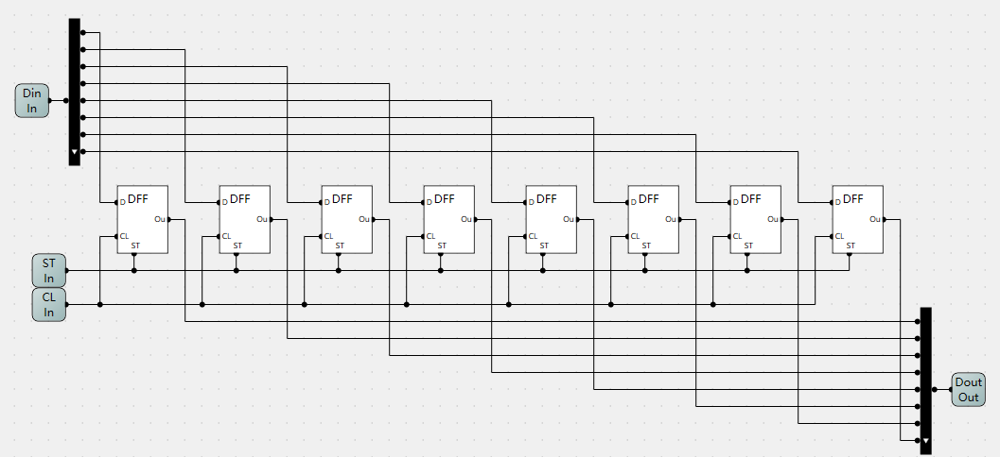

<!--
 * @Author: Dongze Yang
 * @Date: 2024-03-29 15:59:36
 * @LastEditors: Dongze Yang
 * @LastEditTime: 2024-03-29 19:43:02
 * @Description: 
-->
# TriGate

This is a Tri-State gate for 8-bit input data. It has an 8-bit input and output and an ``en`` input to control whether the part is enabled. When ``en=false``, there should be no output from a hardware point of view, but from our simulation point of view, we set the output to ``false`` at this point.

# Decoder38

3 to 8 decoder. The input is an address of length 3, and the output is an address of length 8. For example, if the input is ``010`` and the decimal representation is ``2``, then the output is ``00000100``, i.e., the second digit from the right (from 0) is true.

# Selector88

This is an 8-bit, 8-input selector with an input address length of 3. The output is a piece of data that is selected.

Assume that there are inputs:

    d0 = [00000000] 
    d1 = [00000001]
    d2 = [00000010] 
    d3 = [00000011] 
    d4 = [00000100] 
    d5 = [00000101] 
    d6 = [00000110] 
    d7 = [00000111] 

    ad2, ad1, ad0 = 1, 0, 0

This means take the 1002th = 410th data (starting from 0), then the output is:

    00000100

# BYTE

This is actually part of an 8-bit register that is part of ``/m500_memory/Register.arc`` in our MontiArc model. The input is 8-bits, each DFF can store 1 bit of data, and the output is the stored data. However, based on subsequent practical requirements, two additional control inputs need to be added: `w`(write) and `r`(read). For this, it is necessary to combine this part with the previous 8-bit Tri-State gate to get the final Register.

# Register

8-bit register with inputs `w` and `r` for read and write control.

# RAM8

Memory capable of randomly accessing eight 8-bit data.
In the MontiArc model, multiple ports cannot be connected to the same output port, so an additional Selector88 is needed to merge the outputs.
In addition, according to our implementation, we default the ``read`` operation constant to ``true`` and the ``write signal == st(store signal)``.

